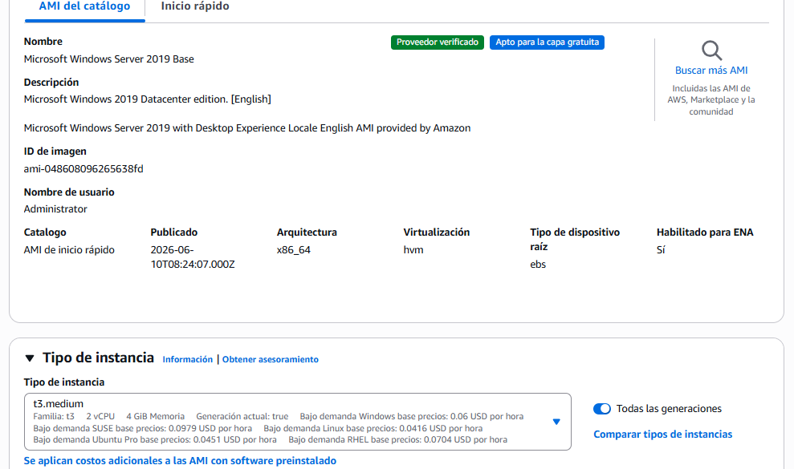

# Evaluación Formativa 3

## Alumno:

- Sebastián Zambrano

## Profesor:

- Jorge Ramirez

## Desarrollo:

### Windows Server 2019

- Creación de la instancia

- Creacion del grupo de seguridad RPD con mi nombre

- Conexión Realizada RPD: (key: Uw=fnaLEyg?HE8-u??vEbIDM6!N3=kgv)

### Linux:

- creacion de instancia:

- Creación grupo de seguridad

- Resumen de la creación de la instancia:

- Comprobar Funcionamiento por SSH

